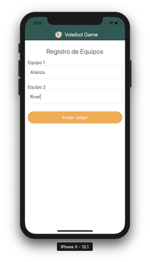

# voleibol-app
**React Native App for Voleibol Project.**

If you want run localy this project, is preferable to use a mac. Follow the next steps.

1. Clone this project
2. Enter to cloned project folder and run `npm install`.
3. Run `react-native link` and `react-native link react-native-gesture-handler`.
4. For IOS Simulator run `react-native run-ios`.

You Can too Test the Android App, installing this apk: (Android App)[https://drive.google.com/file/d/1BGD0i8MWpnyezyUOPqVwzSpaH2M92rjz/view?usp=sharing]

This project works with:
* (Redux)[https://github.com/reduxjs/redux]
* (React Redux)[https://github.com/reduxjs/react-redux]
* (Redux Thunk)[https://github.com/reduxjs/redux-thunk]
* (React Navigation)[https://github.com/react-navigation/react-navigation]
* (Native Base)[https://github.com/GeekyAnts/NativeBase]

IOS ScreenShots.

