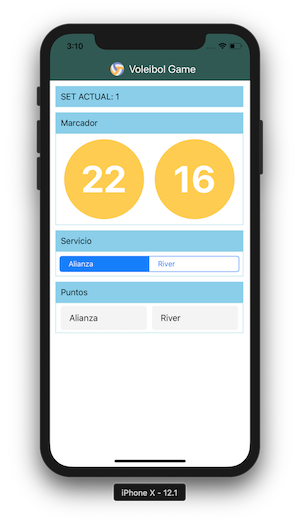
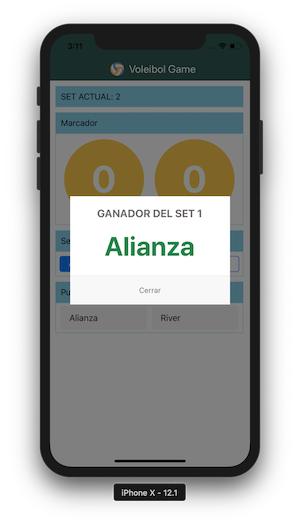

# voleibol-app
**React Native App for Voleibol Project.**

If you want run localy this project, is preferable to use a mac. Follow the next steps.

1. Clone this project
2. Enter to cloned project folder and run `npm install`.
3. Run `react-native link` and `react-native link react-native-gesture-handler`.
4. For IOS Simulator run `react-native run-ios`.

ScreenShots.

